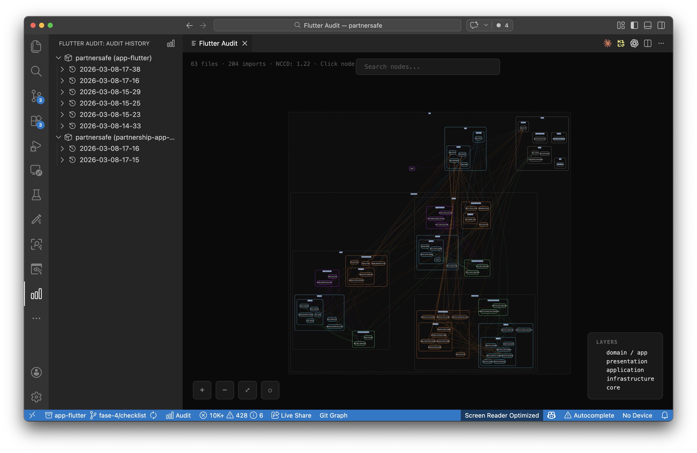
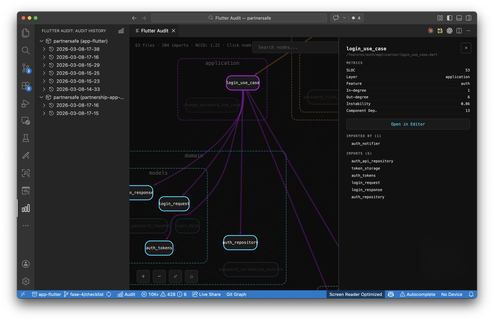

# Flutter Audit

**See your architecture before it becomes a problem.**

Flutter Audit turns your project's internal dependencies into an interactive, color-coded graph — right inside VS Code. Instead of discovering coupling issues during code review or after a refactor goes wrong, you see them instantly: which files depend on what, where cycles hide, and how clean your layers really are.

## Why

As Flutter projects grow, certain problems become invisible in day-to-day development:

- A "domain" model quietly imports an infrastructure adapter
- Two features develop a circular dependency through shared widgets
- A screen file creeps past 600 lines without anyone noticing
- Relative imports scatter across the codebase, making moves painful

These issues compound. By the time they surface, fixing them means untangling dozens of files.

Flutter Audit makes these problems **visible and measurable** — every time you run it.

## What You Get

**Interactive Dependency Graph** — A force-directed visualization where every file is a node, every import is an edge, and layers are color-coded. Click any node to see its coupling metrics and navigate to the source.

**Architecture Enforcement** — Circular dependency detection, relative import violations, and file size limit checks. Conventions that live in a wiki become rules that get checked.

**Coupling Metrics** — NCCD, CCD, ACD, in-degree, out-degree, and instability per file. Powered by [lakos](https://pub.dev/packages/lakos). Know exactly which files are your highest-risk coupling points.

**Audit History** — Every run is timestamped and browsable from the sidebar. Track how your architecture evolves across sprints.

**Monorepo Support** — Detects multiple Dart/Flutter projects in your workspace. Pick which one to audit, or browse history across all of them.

**Zero Setup** — Graphviz renders via WebAssembly. No `brew install`, no system dependencies. Install the extension and go.

## Quick Start

1. Install from the VS Code Marketplace
2. Open the command palette and run **Flutter Audit: Run Audit**
3. If [lakos](https://pub.dev/packages/lakos) isn't installed, the extension will offer to add it automatically
4. Explore the interactive graph

The extension also works without lakos — you still get file stats, size limit checks, import analysis, and `dart analyze` results. Lakos adds the dependency graph and coupling metrics.

## Graph Viewer

A dark-themed interactive visualization:

- **Scroll** to zoom, **drag** to pan
- **Click a node** to highlight its dependencies and see metrics
- **`/`** to search, **`Esc`** to clear
- **Open in Editor** navigates directly to the file





### Automatic Layer Detection

Nodes are automatically colored by architectural layer — no configuration needed. The classifier combines three strategies to work with any project structure:

- **Directory analysis** — groups files by their directory path (e.g., `models/`, `screens/`, `services/`)
- **Content analysis** — reads file headers to detect Flutter UI imports, state managers, data access patterns, and abstract contracts
- **Graph inference** — uses coupling metrics (instability, in-degree, out-degree) to identify stable foundations vs. volatile entry points

Each directory becomes a cluster, with subdirectories rendered as nested clusters. Colors are assigned automatically based on layer size.

## Configuration

All settings live under `flutterAudit.*` in VS Code settings:

| Setting | Default | Description |
|---|---|---|
| `layoutEngine` | `fdp` | Graphviz engine (`fdp`, `dot`, `neato`, `circo`, `sfdp`) |
| `sizeLimits` | `{screens: 400, widgets: 300, services: 350}` | Max lines per file type |
| `outputDirectory` | `audit` | Where audit artifacts are saved |
| `generatedFilePatterns` | `[**.freezed.dart, **.g.dart, **.gr.dart]` | Generated files to exclude |

## Audit Output

Each run creates a timestamped directory with everything you need for async review or CI integration:

```
audit/2026-03-08-14-33/
├── audit-graph.svg          # Rendered dependency graph
├── audit-deps.json          # Full metrics (nodes, edges, coupling)
├── audit-summary.txt        # Top coupled files, NCCD
├── audit-stats.txt          # File counts, SLOC per directory
├── audit-circular.txt       # Circular dependency report
├── audit-analyze.txt        # dart analyze results
├── audit-limits.txt         # Size limit violations
└── audit-imports.txt        # Relative import violations
```

## Contributing

Contributions are welcome! See [CONTRIBUTING.md](CONTRIBUTING.md) for development setup, project structure, and guidelines.

## License

MIT — [Tekne Studio](https://github.com/tekne-studio)
